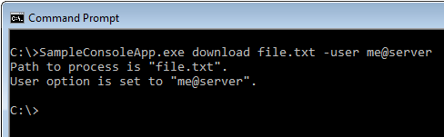
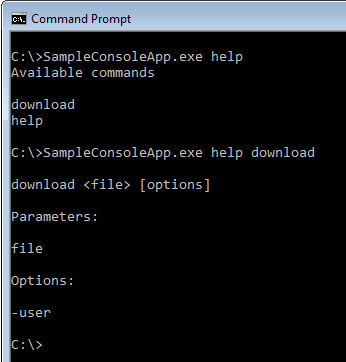

So far we have a freshly generated console application:  


namespace SampleConsoleApp
{
    class Program
    {
        static void Main(string[] args)
        {
        }
    }
}

  
With a reference to the Console Toolkit library:

  

#### Step 1

The first thing we need to do is make the application a toolkit application by adding a base class. Add a using statement for `ConsoleToolkit.ApplicationStyles` and make your program class inherit from `CommandDrivenApplication`:


using ConsoleToolkit.ApplicationStyles;

namespace SampleConsoleApp
{
    class Program : CommandDrivenApplication
    {
        static void Main(string[] args)
        {
        }
    }
}



#### Step 2
The toolkit wants control of the application, so we need to hand over to it. This is a form of inversion of control, in which the toolkit is going to take responsibility for parsing the command line, and it will call our code with the command parameters and options it finds if they are valid. We will specify the details of the command parameters and options shortly, but for now we will just hand over control.  

Add a using for `ConsoleToolkit` at the top, and add the following line to the `Main` function body:


            Toolkit.Execute<Program>(args);


This call tells the toolkit about our application class, and hands it the command line arguments. Behind the scenes, the toolkit will create an instance of the `Program` class, so it's important that the class has no constructor parameters, or the toolkit will express its displeasure by throwing exceptions at you.

You should now have this:


using ConsoleToolkit;
using ConsoleToolkit.ApplicationStyles;

namespace SampleConsoleApp
{
    class Program : CommandDrivenApplication
    {
        static void Main(string[] args)
        {
            Toolkit.Execute<Program>(args);
        }
    }
}


#### Step 3
So far so good. If you run the program now, you will get a `CommandConfigurationInvalid` exception. This is the toolkit complaining that it doesn't have any command definitions. Lets cheer it up.

Add a class to the application called `DownloadCommand`, and make it look like this:


using ConsoleToolkit.CommandLineInterpretation.ConfigurationAttributes;

namespace SampleConsoleApp
{
    [Command]
    class DownloadCommand
    {
    }
}


This is the bare minimum we need and specifies that our application has a "download" command that takes no parameters and has no options. That's a bit dull, and we'll move on from there in a moment, but first notice the `[Command]` attribute. This attribute marks the class so that the toolkit will take notice of it and use it as the specification of our command line parameters.

#### Step 4
We need to add some parameters, which the toolkit likes to refer to as "positionals", since options could also be construed as parameters.

Lets pretend that we are building a utility that allows us to access files on a remote server of some kind. Lets say we want the user to invoke the application with a command that initiates a download, and takes the file name as a parameter, like this:

`SampleConsoleApp download testfile.txt`

Here, "download" is the command, and "testfile.txt" is the parameter.

To define this to the toolkit, all we need to do is add a property to the `DownloadCommand` class:


using ConsoleToolkit.CommandLineInterpretation.ConfigurationAttributes;

namespace SampleConsoleApp
{
    [Command]
    class DownloadCommand
    {
        [Positional]
        public string File { get; set; }
    }
}


As you can see, we are adding a public property with a `[Positional]` attribute, which will cause the toolkit to add a positional parameter to the configuration it uses to parse the command line.

#### Step 5
Lets add an option to the command line next, so that the user can specify credentials:

`SampleConsoleApp download testfile.txt -user person@domainname`

Adding the option is equally simple. We need another property, but with an `[Option]` attribute this time. This gives us:


using ConsoleToolkit.CommandLineInterpretation.ConfigurationAttributes;

namespace SampleConsoleApp
{
    [Command]
    class DownloadCommand
    {
        [Positional]
        public string File { get; set; }

        [Option]
        public string User { get; set; }
    }
}


This will cause the toolkit to configure the option with "user" as it's name.

There is no limit to the number of `[Positional]` and `[Option]` properties you can specify in the options, and you can control the option names or give them aliases if you wish (i.e. we could have it accept both 'u' and 'user' if we wanted).

If you feel like it, you can run the application now, and watch the toolkit validate the command line parameters. It will only accept one positional parameter and the `-user` option. However, if you specify valid parameters, it will complain that it has no "command handler", which means it wants to pass control to us but we've not given it anything to call. Lets do that next.

#### Step 6
There are several ways to add a command handler, but I'm going to use my preferred method in this tutorial, and add the handler to the `DownloadCommand` class itself. This is referred to as a "self handling" command.

This results in:

using ConsoleToolkit.CommandLineInterpretation.ConfigurationAttributes;
using ConsoleToolkit.ConsoleIO;

namespace SampleConsoleApp
{
    [Command]
    class DownloadCommand
    {
        [Positional]
        public string File { get; set; }

        [Option]
        public string User { get; set; }

        [CommandHandler]
        public void Handle(IConsoleAdapter console, IErrorAdapter error)
        {
            console.WrapLine("Path to process is \"{0}\".", File);
            console.WrapLine("User option is set to \"{0}\".", User);
        }
    }
}


For the purposes of the tutorial, the handler is simply displaying the parameters supplied to the program. You can go ahead and test it now. Here's an example:  

#### Step 7
Our program is functional, in that we are getting our command parsed and validated, and we have a place to implement our functionality. It would be nice to offer command line help to the user. This is a feature the toolkit offers, so lets add it.

The first thing we need is a command to allow the user to ask for help. So lets add one:

using ConsoleToolkit.CommandLineInterpretation.ConfigurationAttributes;

namespace SampleConsoleApp
{
    [Command]
    class HelpCommand
    {
        [Positional(DefaultValue = null)]
        public string Topic { get; set; }
    }
}


Here I've added a "help" command, with a positional parameter called "Topic" which is important as will be seen in the next step. However, there is one interesting feature we did not need in the "download" command, namely the "DefaultValue" parameter on the "Positional" attribute:


        [Positional(DefaultValue = null)]
        public string Topic { get; set; }


Specifying a default value for a positional parameter means the toolkit can treat the parameter as optional. This is needed because we want this to work:

`SampleConsoleApp help`

But we also want to be able to ask for command specific help like this:

`SampleConsoleApp help`

This is supported by the toolkit, as we will see next.

#### Step 8

Now that we have a help command, we need to tell the toolkit about it. We don't have to implement the display code ourselves, the toolkit contains all the code for a basic help facilty,but we do need to ask for the functionality. To do that, we need to go back to our program class and override a method from the base class called `Initialise`. Note the British spelling. It's because I'm British.


using ConsoleToolkit;
using ConsoleToolkit.ApplicationStyles;

namespace SampleConsoleApp
{
    class Program : CommandDrivenApplication
    {
        static void Main(string[] args)
        {
            Toolkit.Execute<Program>(args);
        }

        protected override void Initialise()
        {
            base.HelpCommand<HelpCommand>(c => c.Topic);
            base.Initialise();
        }
    }
}


If you run the program with the `help` command, you should see this:

Here I've run:

`SampleConsoleApp.exe help`

and then:

`SampleConsoleApp.exe help download`

This demonstrates that the help support is working, but we really need to add some explanatory text. Let's do that now.

#### Step 9
Adding descriptive text to the help is very simple to do. We just have to attach `[Description(...` attributes to the command classes.

First, the "Download" command:


using ConsoleToolkit.CommandLineInterpretation.ConfigurationAttributes;
using ConsoleToolkit.ConsoleIO;

namespace SampleConsoleApp
{
    [Command]
    [Description("Download a file from the server.")]
    class DownloadCommand
    {
        [Positional]
        [Description("The name of the file.")]
        public string File { get; set; }

        [Option]
        [Description("The user credentials.")]
        public string User { get; set; }

        [CommandHandler]
        public void Handle(IConsoleAdapter console, IErrorAdapter error)
        {
            console.WrapLine("Path to process is \"{0}\".", File);
            console.WrapLine("User option is set to \"{0}\".", User);
        }
    }
}


And also the "help" command:


using ConsoleToolkit.CommandLineInterpretation.ConfigurationAttributes;

namespace SampleConsoleApp
{
    [Command]
    [Description("Display command line help.")]
    class HelpCommand
    {
        [Positional(DefaultValue = null)]
        [Description("The topic on which help is required.")]
        public string Topic { get; set; }
    }
}


Now the program gives better help output:

#### Finished

So we have a trivial but working console application. This tutorial has demonstrated the minimum features of the toolkit you need to get up and running but there's a lot more to it. Before moving on, take a few minutes to play with the demo application. Test out the command line validation. Try resizing the console window, and see it word wrap the help text and the command output.

We've only scratched the surface of what's possible for command line parameters, and the ways in which data can be formatted. We've not even touched on the way that user input can be captured, or the fact that you can choose which command line parsing standard you want enforced.

