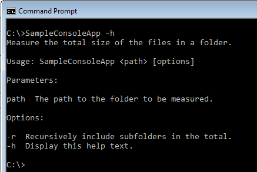

So far we have a freshly generated console application:  


namespace SampleConsoleApp
{
    class Program
    {
        static void Main(string[] args)
        {
        }
    }
}

  
With a reference to the Console Toolkit library:

####Step 1

The first thing we need to do is make the application a toolkit application by adding a base class. Add a using statement for `ConsoleToolkit.ApplicationStyles` and make your program class inherit from `ConsoleApplication`:


using ConsoleToolkit.ApplicationStyles;

namespace SampleConsoleApp
{
    class Program : ConsoleApplication
    {
        static void Main(string[] args)
        {
        }
    }
}


####Step 2
The toolkit wants control of the application, so we need to hand over to it. This is a form of inversion of control, in which the toolkit is going to take responsibility for parsing the command line, and it will call our code with the parameters and options it finds if they are valid. We will specify the details of the parameters and options shortly, but for now we will just hand over control.  

Add a using for `ConsoleToolkit` at the top, and add the following line to the `Main` function body:


            Toolkit.Execute<Program>(args);


This call tells the toolkit about our application class, and hands it the command line arguments. Behind the scenes, the toolkit will create an instance of the `Program` class, so it's important that the class has no constructor parameters, or the toolkit will express its displeasure by throwing exceptions at you.

You should now have this:


using ConsoleToolkit;
using ConsoleToolkit.ApplicationStyles;

namespace SampleConsoleApp
{
    class Program : ConsoleApplication
    {
        static void Main(string[] args)
        {
            Toolkit.Execute<Program>(args);
        }
    }
}

####Step 3
So far so good. If you run the program now, you will get a `ConsoleApplicationRequiresDefaultCommand` exception. This is the toolkit complaining that it doesn't have any command line options. Lets cheer it up.

Add a class to the application called `Options`, and make it look like this:


using ConsoleToolkit.CommandLineInterpretation.ConfigurationAttributes;

namespace SampleConsoleApp
{
    [Command]
    class Options
    {
    }
}

This is the bare minimum we need and specifies that our application takes no parameters and has no options. That's a bit dull, and we'll move on from there in a moment, but first notice the `[Command]` attribute. This attribute marks the class so that the toolkit will take notice of it and use it as the specification of our command line parameters.

####Step 4
We need to add some parameters, which the toolkit likes to refer to 
as "positionals", since options could also be construed as parameters.

Lets pretend that we are building a utility that measures the total size of all the files in a directory. We won't actually implement the functionality, we'll just configure the toolkit to parse the parameters.

Lets say we want the user to invoke the application with a path name, like this:

`SampleConsoleApp C:\`

To define this to the toolkit, all we need to do is add a property to the `Options` class:


using ConsoleToolkit.CommandLineInterpretation.ConfigurationAttributes;

namespace SampleConsoleApp
{
    [Command]
    class Options
    {
        [Positional]
        public string Path { get; set; }
    }
}

As you can see, we are adding a public property with a `[Positional]` attribute, which will cause the toolkit to add a positional parameter to the configuration it uses to parse the command line.

####Step 5
Lets add an option to the command line next, so that the user can request that the program add in the files in child folders recursively by entering:

`SampleConsoleApp C:\ -r`


using ConsoleToolkit.CommandLineInterpretation.ConfigurationAttributes;

namespace SampleConsoleApp
{
    [Command]
    class Options
    {
        [Positional]
        public string Path { get; set; }

        [Option("r")]
        public bool Recursive { get; set; }
    }
}


As you can see, I've also given the attribute a parameter of "r". This will cause the toolkit to configure the option with "r" as it's name. If I had not specified the option name, the property name would have been used, but we don't want the user to have to type `SampleConsoleApp C:\ -recursive`, and we don't want the property to be called `R` either.

There is no limit to the number of `[Positional]` and `[Option]` properties you can specify in the options.

If you feel like it, you can run the application now, and watch the toolkit validate the command line parameters. It will only accept one positional parameter and the `-r` option. However, if you specify valid parameters, it will complain that it has no "command handler", which means it wants to pass control to us but we've not given it anything to call. Lets do that next.

####Step 6
There are several ways to add a command handler, but I'm going to use my preferred method in this tutorial, and add the handler to the `Options` class itself. This is referred to as a "self handling" command.

This results in:

using ConsoleToolkit.CommandLineInterpretation.ConfigurationAttributes;
using ConsoleToolkit.ConsoleIO;

namespace SampleConsoleApp
{
    [Command]
    class Options
    {
        [Positional]
        public string Path { get; set; }

        [Option("r")]
        public bool Recursive { get; set; }

        [CommandHandler]
        public void Handler(IConsoleAdapter console, IErrorAdapter error)
        {
            console.WrapLine("Path to process is \"{0}\".", Path);
            console.WrapLine("Recursive option is set to \"{0}\".", Recursive);
        }
    }
}


For the purposes of the tutorial, the handler is simply displaying the parameters supplied to the program. You can go ahead and test it now. Here's an example:  

####Step 7
Our program is functional, in that we are getting our parameters parsed and validated, and we have a place to implement our functionality. It would be nice to offer command line help to the user. This is a feature the toolkit offers, so lets add it.

The first thing we need is an option to allow the user to ask for help. So lets add one:

using ConsoleToolkit.CommandLineInterpretation.ConfigurationAttributes;
using ConsoleToolkit.ConsoleIO;

namespace SampleConsoleApp
{
    [Command]
    class Options
    {
        [Positional]
        public string Path { get; set; }

        [Option("r")]
        public bool Recursive { get; set; }

        [Option("h", ShortCircuit = true)]
        public bool Help { get; set; }

        [CommandHandler]
        public void Handler(IConsoleAdapter console, IErrorAdapter error)
        {
            console.WrapLine("Path to process is \"{0}\".", Path);
            console.WrapLine("Recursive option is set to \"{0}\".", Recursive);
        }
    }
}


Here I've added the "h" option, using the `Option` attribute again, but this time with a slightly difference in the specification:


[Option("h", ShortCircuit = true)]
public bool Help { get; set; }


Notice it specifies `ShortCircuit = true`, which has a special meaning to the toolkit. It's nothing to do with providing help, per se, it's actually a modification to the command line validation, telling the toolkit that if it sees the "h" option, it can ignore the rest of the command line. This is needed because we want:

`SampleConsoleApp -h`

to be valid. Without `ShortCircuit = true`, the toolkit would reject it because no value is specified for `Path`.

####Step 8

Next we have to tell the toolkit about our help option. We don't have to implement the display code ourselves, the toolkit will do it for us, but we do need to ask for the functionality. To do that, we need to go back to our program class and override a method from the base class called `Initialise`. Note the British spelling. It's because I'm British.


using ConsoleToolkit;
using ConsoleToolkit.ApplicationStyles;

namespace SampleConsoleApp
{
    class Program : ConsoleApplication
    {
        static void Main(string[] args)
        {
            Toolkit.Execute<Program>(args);
        }

        protected override void Initialise()
        {
            base.HelpOption<Options>(o => o.Help);
            base.Initialise();
        }
    }
}


If you run the program with the `-h` option, you should see this:

Which is not totally useless, but needs some text.

####Step 9
Lets add some descriptive text to the help.

This is very simple to do. We just have to attach `[Description(...` attributes to the `Options` class:


using ConsoleToolkit.CommandLineInterpretation.ConfigurationAttributes;
using ConsoleToolkit.ConsoleIO;

namespace SampleConsoleApp
{
    [Command]
    [Description("Measure the total size of the files in a folder.")]
    class Options
    {
        [Positional]
        [Description("The path to the folder to be measured.")]
        public string Path { get; set; }

        [Option("r")]
        [Description("Recursively include subfolders in the total.")]
        public bool Recursive { get; set; }

        [Option("h", ShortCircuit = true)]
        [Description("Display this help text.")]
        public bool Help { get; set; }

        [CommandHandler]
        public void Handler(IConsoleAdapter console, IErrorAdapter error)
        {
            console.WrapLine("Path to process is \"{0}\".", Path);
            console.WrapLine("Recursive option is set to \"{0}\".", Recursive);
        }
    }
}


And the program now gives better help output:

####Finished

So we have a trivial but working console application. This tutorial has demonstrated the minimum features of the toolkit you need to get up and running but there's a lot more to it. Before moving on, take a few minutes to play with the demo application. Test out the command line validation. Try resizing the console window, and see it word wrap the help text and the command output.

We've only scratched the surface of what's possible for command line parameters, and the ways in which data can be formatted. We've not even touched on the way that user input can be captured, or the fact that you can choose which command line parsing standard you want enforced.