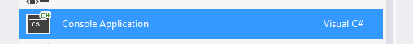
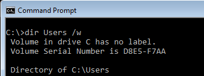

Lets start a new console project. I'm going to walk you through a simple set of steps to create a basic console application using the Console Toolkit. It'll reflect how I like to set up my apps, which isn't the only way, and you will find alternatives in the main documentation.
                            

####Step 1

Power up Visual Studio, and create a new Console Application.

####Step 2

Add the Console Toolkit reference.

####Step 3

Your Program.cs should look something like this...

namespace SampleConsoleApp
{
    class Program
    {
        static void Main(string[] args)
        {
        }
    }
}

  
####Step 4

Where we go from here depends on what style of application you are building. The differences have a minor impact on the code, but in the interests of simplicity, I'll cover them separately. So, to continue, choose from...  

- [A simple console application.](consoleapplication.html)  

The is the most common style. It's an application that basically does a single job with options to control how it does it. For example:  

  
 
The "dir" command's job is to list the contents of the file system. Its parameters and options let you customise the way it does this job, but it is essentially a one trick pony. Most Windows commands are of this type.
  
- [A command driven application.](commanddrivenapplication.html)

This is a less common style, but it is the style adopted by some of the more sophisticated command line applications. The command line interface of most source control systems I've used have had a command driven style. There is also a built in Windows command that uses it:  

  

The "net" command has lots of functionality, and you select what you want to do by specifying a command name as the first parameter. Each command has a different function, and its own distinct set of parameters and options. For example, "net use" will list all of the drive mappings you have set up to network resources, whereas "net config workstation" will display information about the computer on which the command is executed.   

You can build either type of application with the Console Toolkit.  

---
_Although the tutorial forks here, switching an application from one style to the other is a very quick and simple process, so don't read too much into the fact that the two styles are treated separately. I'm just trying to keep the tutorial simple._
  