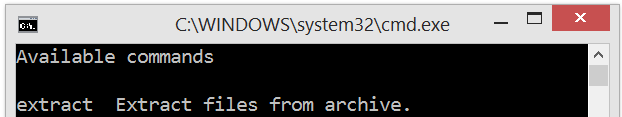
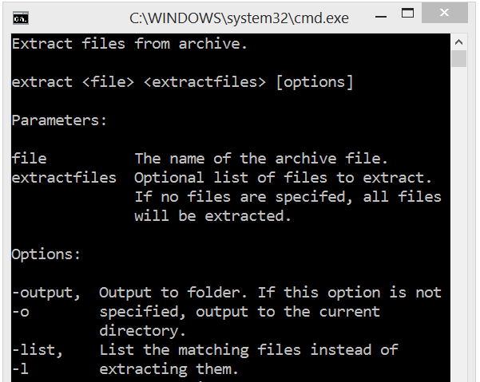
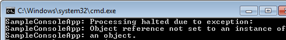

A Command Driven Application is a special case of console application which has a command based architecture. Examples include the Windows NET command and the command line interface of all of the source control applications I've ever used.

For example, this is a screenshot from git: 

This shows the git commands that are available.

The steps required to create a Toolkit command driven application starting from the default Console Application template are detailed in the [Getting Started](/GettingStarted/commanddrivenapplication.html) guide.

Here we will take a more detailed look at the specifics of a Toolkit application derived from the `CommandDrivenApplication` base class in `ConsoleToolkit.ApplicationStyles`.

## Deriving from `CommandDrivenApplication`

using ConsoleToolkit;
using ConsoleToolkit.ApplicationStyles;

namespace SampleConsoleApp
{
    class Program : CommandDrivenApplication
    {
        static void Main(string[] args)
        {
            Toolkit.Execute<Program>(args);
        }
    }
}

This is the minimum possible `Main` function. The Toolkit will scan the assembly for classes with the `[Command]` attribute, from which it will load the command line configuration ([see here](commandoverview.html)), and methods with the `[CommandHandler]` attribute.

Here is an example:


[Command]
[Description("Extract files from archive.")]
class Extract
{
    [Positional]
    [Description("The name of the archive file.")]
    public string File { get; set; }

    [Positional]
    [Description("Optional list of files to extract. If no files are specifed, all files will be extracted.")]
    public List<string> ExtractFiles { get; set; }   
    
    [Option("output", "o")]
    [Description("Output to folder. If this option is not specified, output to the current directory.")]
    public string Output { get; set; }
    
    [Option("list", "l")]
    [Description("List the matching files instead of extracting them.")]
    public bool List { get; set; }

    [CommandHandler]
    public void Handle(IConsoleAdapter console, IErrorAdapter error)
    {
        var data = new[]
        {
              new {Parameter = "Archive", Value = File}
            , new {Parameter = "File List", Value = string.Join(", ", ExtractFiles)}
            , new {Parameter = "Output folder", Value = Output}
            , new {Parameter = "List option", Value = List.ToString()}
        };
        console.FormatTable(data, ReportFormattingOptions.OmitHeadings);
    }
}


In this case the command handler is part of the command class itself. There are several options for the location of command handlers ([see here](defininghandlers.html)).

### Initialisation
Initialisation can be performed in a number of places, and the selection of the correct alternative depends on when you want the initialisation to take place.

* If you want the initialisation to run unconditionally, prior to handover to any Toolkit code running, you can call it before you call `Toolkit.Execute<Program>(args);` This is the earliest possible initialisation point and is totally outside of the Toolkit's control.


using ConsoleToolkit;
using ConsoleToolkit.ApplicationStyles;

namespace SampleConsoleApp
{
    class Program : CommandDrivenApplication
    {
        static void Main(string[] args)
        {
            //Initialisation code here
            Toolkit.Execute<Program>(args);
        }
    }
}

* The `CommandDrivenApplication` base class has an overridable `Initialise` method which is called by the Toolkit just prior to validation of the command line parameters. This is a good place to set up the [objects to be injected into your command handlers](ioc.html) if you are using this feature.


class Program : CommandDrivenApplication`
{
    static void Main(string[] args)
    {
        Toolkit.Execute<Program>(args);
    }

    protected override void Initialise()
    {
        //Initialisation code here
        base.Initialise();
    }
}


* If you wish to perform initialisation only if the command line parameters are valid, override `OnCommandLineValid`. This method is called before the command handler is executed, and is passed the valid command as an `object` reference.


class Program : CommandDrivenApplication
{
    static void Main(string[] args)
    {
        Toolkit.Execute<Program>(args);
    }

    protected override void OnCommandLineValid(object command)
    {
        //Initialisation code here
        base.OnCommandLineValid(command);
    }
}


### Help Text
The `CommandDrivenApplication` supports the automatic generation of help text.

By default, a help message will be displayed if the application is run without command line parameters. This text will be built using the command line configuration loaded from the application's `[Command]` classes. The `[Description("...")]` attribute can be used to supply descriptive text. See [the documentation on command definitions](commandoverview.html) for details.

Here is the text generated from the `Extract` class illustrated above:

To allow the user to request the help text, a help command can be supplied. You can define whatever command you wish for this purpose, and the `CommandDrivenApplication` base class just needs to be told about the command, and how to detect a help topic. This is done by overriding the `Initialise` method and calling `HelpOption`. For example:


protected override void Initialise()
{
    HelpCommand<HelpCommand>(h => h.Topic);
    base.Initialise();
}


`HelpCommand` is a generic method, parameterised with the type of your `[Command]` class that should be used to invoke the help facility. For example:


[Command]
[Description("Display a list of commands or get a detailed description of a specific command.")]
class HelpCommand
{
    [Positional(DefaultValue = null)]
    [Description("The command to display.")]
    public string Topic { get; set; }
}


Slightly confunsingly, I've called the class that defines the help command `HelpCommand`, which is also the same as the method on the base `CommandDrivenApplication` class. However, the compiler is fine with it, and it's actually very likely to be what you would naturally code (it's what I always code). 

`CommandDrivenApplication.HelpCommand` also takes a lambda function (or other delegate) that returns a String help topic value. The toolkit will invoke the delegate when it receives a help command, and if the delegate returns a string, it will use the string as a help topic. For example, the command:

`SampleCommandApp help extract`

yields:

The help topic parameter should be defined as an optional string positional parameter as it is in the example given above. The most important point to note is that the parameter is optional because a default value is defined:


[Positional(DefaultValue = null)]

 
### Post command triggers
You can write code that is triggered by the success or failure of the command handler.

#### OnCommandSuccess
Override `OnCommandSuccess` to carry out processing that should only execute if the command executed correctly. If the handler throws an exception, or sets the process exit code (`Environment.ExitCode`) to a non-zero value, this will not be called. An example of where I have used this is for saving user settings. If the command failed, I didn't want the settings to change.

  
protected override void OnCommandSuccess()
{
    Console.WrapLine("Command successful.");
    base.OnCommandSuccess();
}


#### OnCommandFailure
Override `OnCommandFailure` to carry out processing that should only execute if the command did not execute correctly. If the handler throws an exception, or sets the process exit code (`Environment.ExitCode`) to a non-zero value, this *will* be called. 

  
protected override void OnCommandFailure()
{
    Console.WrapLine("Command failed.");
    base.OnCommandFailure();
}


### Exceptions
If a command handler throws an exception, it will, by default, be caught by the toolkit:

 

`Environment.ExitCode` will be set to 500.

A custom exception handler can be installed by calling `Toolkit.SetCmmandExceptionHandler`. For example:

  
protected override void Initialise()
{
    Toolkit.SetCommandExceptionHandler(ExceptionHandler);
}


The `ExceptionHandler` should be a method with the signature:

`void ExceptionHandler(IConsoleAdapter console, IErrorAdapter error, Exception exception, object options)`

Where `options` will be the command options object containing the parsed program parameters. `Environment.ExitCode` will not be overwritten if it is set by the exception handler. 