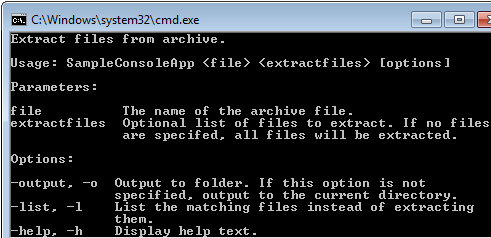

A Console Application is a traditional command prompt application, which usually has one main job to do and takes its parameters from the command line. Often, the way in which the program carries out its purpose can be controlled using optional parameters.

The steps required to create a Toolkit console application from the default Console Application template are detailed in the [Getting Started](/GettingStarted/consoleapplication.html) guide.

Here we will take a more detailed look at the specifics of a Toolkit application derived from the `ConsoleApplication` base class in `ConsoleToolkit.ApplicationStyles`.

##Deriving from `ConsoleApplication`

using ConsoleToolkit;
using ConsoleToolkit.ApplicationStyles;

namespace SampleConsoleApp
{
    class Program : ConsoleApplication
    {
        static void Main(string[] args)
        {
            Toolkit.Execute<Program>(args);
        }
    }
}

This is the minimum possible `Main` function. The Toolkit will scan the assembly for a class with the `[Command]` attribute, from which it will load the command line configuration ([see here](commandoverview.html)), and a method with the `[CommandHandler]` attribute.

Here is an example:


	  
    [Command]
    [Description("Extract files from archive.")]
    class Options
    {
        [Positional]
        [Description("The name of the archive file.")]
        public string File { get; set; }

        [Positional]
        [Description("Optional list of files to extract. If no files are specifed, all files will be extracted.")]
        public List<string> ExtractFiles { get; set; }   
        
        [Option("output", "o")]
        [Description("Output to folder. If this option is not specified, output to the current directory.")]
        public string Output { get; set; }
        
        [Option("list", "l")]
        [Description("List the matching files instead of extracting them.")]
        public bool List { get; set; }

        [Option("help", "h", ShortCircuit = true)]
        [Description("Display help text.")]
        public bool Help { get; set; }

        [CommandHandler]
        public void Handle(IConsoleAdapter console, IErrorAdapter error)
        {
            var data = new[]
            {
                  new {Parameter = "Archive", Value = File}
                , new {Parameter = "File List", Value = string.Join(", ", ExtractFiles)}
                , new {Parameter = "Output folder", Value = Output}
                , new {Parameter = "List option", Value = List.ToString()}
            };
            console.FormatTable(data, ReportFormattingOptions.OmitHeadings);
        }
    }


In this case the command handler is part of the command class itself. There are several options for the location of command handlers ([see here](defininghandlers.html)).

###Initialisation
Initialisation can be performed in a number of places, and the selection of the correct alternative depends on when you want the initialisation to take place.

* If you want the initialisation to run unconditionally, prior to handover to any Toolkit code running, you can call it before you call `Toolkit.Execute<Program>(args);` This is the earliest possible initialisation point and is totally outside of the Toolkit's control.


using ConsoleToolkit;
using ConsoleToolkit.ApplicationStyles;

namespace SampleConsoleApp
{
    class Program : ConsoleApplication
    {
        static void Main(string[] args)
        {
            //Initialisation code here
            Toolkit.Execute<Program>(args);
        }
    }
}

* The `ConsoleApplication` base class has an overridable `Initialise` method which is called by the Toolkit just prior to validation of the command line parameters. This is a good place to set up the [objects to be injected into your command handlers](ioc.html) if you are using this feature.


class Program : ConsoleApplication
{
    static void Main(string[] args)
    {
        Toolkit.Execute<Program>(args);
    }

    protected override void Initialise()
    {
        //Initialisation code here
        base.Initialise();
    }
}


* If you wish to perform initialisation only if the command line parameters are valid, override `OnCommandLineValid`. This method is called before the command handler is executed, and is passed the command options as an `object` reference.


    class Program : ConsoleApplication
    {
        static void Main(string[] args)
        {
            Toolkit.Execute<Program>(args);
        }

        protected override void OnCommandLineValid(object command)
        {
            //Initialisation code here
            base.OnCommandLineValid(command);
        }
    }


###Help Text
The `ConsoleApplication` supports the automatic generation of help text.

By default, a help message will be displayed if the application is run without command line parameters. This text will be built using the command line configuration loaded from the application's `[Command]` class. The `[Description("...")]` attribute can be used to supply descriptive text. See [the documentation on command definitions](commandoverview.html) for details.

Here is the text generated from the `Options` class illustrated above:

If the application has no mandatory parameters, automatic help will not be displayed by default, because an empty parameter list is valid. To allow the user to request the help text, an option is traditionally supplied, and this can be defined in a `ConsoleApplication` derived program.

You can define whatever option you wish to request the help text, and the `ConsoleApplication` just needs to be able to determine whether help is requested. This is done by overriding the `Initialise` method and calling `HelpOption`. This is a generic method, parameterised with the type of your `[Command]` class and taking a parameter of a lambda function (or other delegate) that returns a boolean True if help is requested. 

For example:


    protected override void Initialise()
    {
        base.HelpOption<Options>(o => o.Help);
        base.Initialise();
    }


The option definition in your `[Command]` class must be specified as a "short circuit" option, which will cause the command line interpreter to stop validating the command line when the option is specified. This is important, because otherwise the user will need to ensure that the command line is valid before they can view the help text. 

Here is an example:


    [Option("help", "h", ShortCircuit = true)]
    [Description("Display help text.")]
    public bool Help { get; set; }

