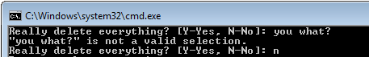
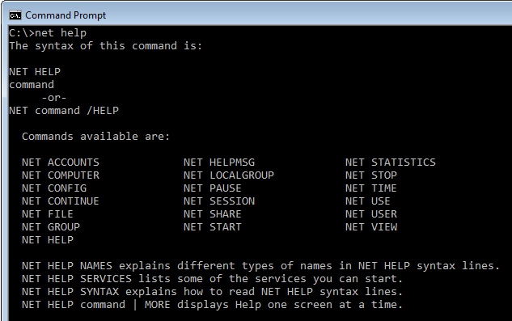

##Toolkit Applications
A Console Toolkit application is a normal console application, which hands the command line arguments into a static `Toolkit` method called `Execute`. The simplest approach is for the call to be made from the console application's static `Main` function:  


using ConsoleToolkit;
using ConsoleToolkit.ApplicationStyles;

namespace SampleConsoleApp
{
    class Program : ConsoleApplication
    {
        static void Main(string[] args)
        {
            Toolkit.Execute<Program>(args);
        }
    }
}

This is a generic method, and you must provide the type of a class derived from one of the Console Toolkit application base classes - either `ConsoleApplication`  (as illustrated above) or `CommandDrivenApplication`. The differences between the two are explained in the next section.

Once it has control, `Execute` performs the following steps:
  
   1. Examines the type parameter to determine the application type.
   2. Creates an instance of the specified type
   3. Determines the command line parameter configuration.
   4. Validates the command line arguments.
   5. Passes control to the handler for the command line arguments if they are valid.

The Toolkit is taking responsibility for everything to do with the command line arguments. The client code is only responsible for [*defining*](commandoverview.html) the command line arguments and for implementing the handler routine that will carry out the program's intended purpose.

The goal of the Toolkit is to allow the developer to start working on the core functionality of the application without having to expend much effort on features that are only needed to enable the program to run in a command prompt.

##Toolkit Features
Here's a quick overview of the main features available from the toolkit:

###Command Line Parameters
A flexible attribute based mechanism is provided, which is described [here](commandoverview.html). There is also a fluent interface, but I am not entirely happy with it and would not recommend relying on it to retain its current form, and it will not be documented. I will revisit this at some stage and hope to offer an officially sanctioned fluent mechanism some time in the future. 

However, the definition of command line parameters does lend itself very well to an attribute based mechanism, and this has proven very easy to use. Here is an example:


using ConsoleToolkit.CommandLineInterpretation.ConfigurationAttributes;

namespace SampleConsoleApp
{
    [Command]
    class Options
    {
        [Positional]
        public string Path { get; set; }

        [Option("r")]
        public bool Recursive { get; set; }
    }
}


###Parsing Conventions
The Toolkit suppors three distinct conventions for parsing the command line:

1. The current Microsoft standard. For example:  
`myapp positionalParam -option setting`
2. Traditional MS-DOS style:  
`myapp positionalParam /Option:setting`
3. POSIX style:  
`myapp positionalParam --option setting`

You can select which convention you would like to use by adding a line before your `Execute` call. For example, this will select MS-DOS conventions:


    class Program : ConsoleApplication
    {
        static void Main(string[] args)
        {
            Toolkit.Options.ParsingConventions = CommandLineParserConventions.MsDosConventions;
            Toolkit.Execute<Program>(args);
        }
    }


The default convention is the current Microsoft standard.

###Command Handler Dependency Injection
Depending on the type of application being built, you will have one or more handlers that the toolkit can call when it has parsed and validated the command line parameters. Handlers are functions that can be created in any of several places, and can accept any parameter list you wish. There is a simple dependency injection mechanism built into the toolkit that allows you to define the services that should be available to your handlers, in order to simplify automated unit testing.

Services can be defined by overriding the `Initialise` method in your `Program` class. For example:


        protected override void Initialise()
        {
            base.RegisterInjectionInstance<IMyService>(new MyServiceImpl());
            base.Initialise();
        }


After the `RegisterInjectionInstance` call, the toolkit can pass the `MyServiceImpl` instance to any handler that has a parameter of type `IMyService`.

###Output Formatting
The traditional `Console.Write` and `Console.Error.Write` mechanisms are still available and will work as expected, but the Toolkit also offers an alternative mechanism that supports features such as word wrapping to the console window size, the automatic formatting of data in tables, and a much more flexible approach to colour. This is offered through the Toolkit `IConsoleAdapter` and `IErrorAdapter` interfaces, and extension methods defined for the `string` type. To access these interfaces, simply define parameters with the appropriate type on your handlers. For example:


        [CommandHandler]
        public void Handle(IConsoleAdapter console, IErrorAdapter error)
        {
            console.WrapLine("This is printed in red.".Red());
        }


###Capturing input from the user
The Toolkit also allows you to support user input through the `IConsoleAdapter` interface. You can prompt the user for a simple confirmation:


            bool deleteIt = console.Confirm("Really delete everything?"); 


 Which will display:

Or you can prompt for more complex data:

  
    var recipe = console.ReadInput(new
    {
        Eggs = Read.Int().Prompt("Number of eggs"),
        Flour = Read.Double()
            .Prompt("Grams of flour")
            .Validate(d => d >= 0.0 && d <= 1000.0, "Please specify an amount up to 1 kilo.")
    });

    console.WrapLine("Eggs: {0},  Flour: {1} grams", recipe.Eggs.Value, recipe.Flour.Value);


###Application Types
The Console Toolkit supports two types of application:

####Console Applications
This is the most common style of application. It's an application that basically does a single job with options to control how it does it. For example:  

  
 
The "dir" command's job is to list the contents of the file system. Its parameters and options let you customise the way it does this job, but it is essentially a one trick pony. Most Windows commands are of this type.

The Console Toolkit supports this type of application through a base class called `ConsoleApplication`. See [the Console application](consoleapps.html) documentation for details.

####Command Driven Applications
This is a less common style, but it is the style adopted by some of the more sophisticated command line applications. The command line interface of most source control systems I've used have had a command driven style. There is also a built in Windows command that uses it:  

  

The "net" command has lots of functionality, and you select what you want to do by specifying a command name as the first parameter. Each command has a different function, and its own distinct set of parameters and options. For example, "net use" will list all of the drive mappings you have set up to network resources, whereas "net config workstation" will display information about the computer on which the command is executed.  

The Console Toolkit supports this type of application through a base class called `CommandDrivenApplication`.
See [the command driven applications](commandapps.html) documentation for details.
 