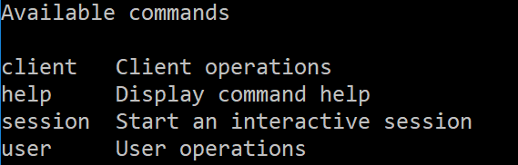
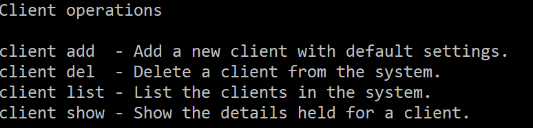
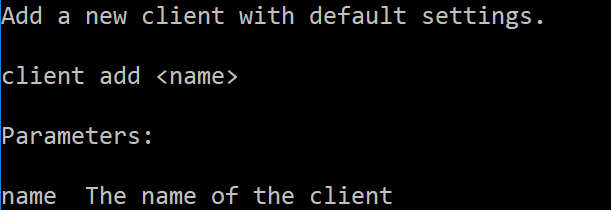

So far we have seen commands defined by a single word, but it is also possible to define commands that require more than one command word to invoke.

For example, you might want to have a range of commands that are grouped logically - they might be commands to manage the same entity:

* `client create` - Add a new client
* `client delete` - Delete an existing client
* `client update` - Update an existing client
* `client show` - Show the details for an existing client

This way you could have similar sets of commands for handling other entities:

* `user create` - Add a new user
* `user delete` - Delete an existing user
* `user update` - Update an existing user
* `user show` - Show the details for an existing user

Alternatively you might want to qualify operations:

* Create operation
  * `create client` - Add a new client
  * `create user` - Add a new user
* Delete operation
  * `delete client` - Delete an existing client
  * `delete user` - Delete an existing user
* Update operation
  * `update client` - Update an existing client
  * `update user` - Update an existing user
* Show operation
  * `show client` - Show the details for an existing client
  * `show user` - Show the details for an existing user

The toolkit supports this requirement through "command keywords". For example:


    [Keyword("user")]
    [Command("add")]
    [Description("Add a new user to the system.")]
    public class UserAddCommand
    {
        etc.

Here the command is called "add" and has a "user" keyword. Keywords precede the command name, so to invoke this command, you would need to specify "user add". 

## Effect on automated help

You can also supply documentation for keywords, which will be used to generate the help text by adding a description to the keyword definition:

`[Keyword("user", "User operations")]`

It will be usual for the keyword to be specified on multiple commands, so it is not mandatory to supply a description, and the help system will check all of the commands specifying the keyword for text. Only the first version of the text found will be used, so in
general it is better to specify the keyword's description only once in the application.

### Allowing multi-word help topics

We've seen the "standard" style of help command in 


[Command]
[Description("Display a list of commands or get a detailed description of a specific command.")]
class HelpCommand
{
    [Positional(DefaultValue = null)]
    [Description("The command to display.")]
    public string Topic { get; set; }
}

Here there is only a single topic, which would not allow us to request help on commands with keywords. i.e. `help user add` would be invalid, because only one positional parameter is allowed.

To define a multi-word help command, we need to change the definition a little:


[Command]
[Description("Display command help")]
class HelpCommand
{
    [Positional(DefaultValue = null)]
    [Description("The topic on which help is required.")]
    public List<string> Topic { get; set; }
}

Above you will notice that the "Topic" property is now a `List<string>` instead of a `string`, which will allow topics with multiple words to be requested.

### Help formatting

If you define a set of commands with the same keyword, the keyword will start to appear in help output:

Here you can see four "commands" - but "client" and "user" are in fact keywords. If we were to specify "client" as a topic, the help
formatting would reflect just the commands with the "client" prefix:

Specifying all of the keywords for a command displays the usual help text for the command. For example, if we specified "client add" as the help topic:

