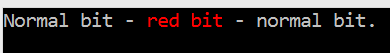
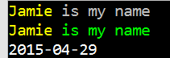

The Console Toolkit defines a common interface, called ```IConsoleOperations``` which is implemented for both program output - via ```IConsoleAdapter``` - and diagnostic output - via ```IErrorAdapter```.

#### Displaying Text
The adapters support the static ```Console``` object's ```Write``` and ```WriteLine``` functionality. In addition, the Toolkit also adds word wrapping based on the window width through ```Wrap``` and ```WrapLine```.

The Word wrapping functionality uses the Console Window width to determine where to put extra line breaks to ensure that individual words are not broken at the end of a line.

In use, the calls are exactly as you would expect:

	adapter.WrapLine("My int is {0}", myInt);

#### Colour
The colour handling features of the default ```Console``` are fairly limited. If you wanted to print one word in red, for example, you might use something like the following:

    Console.Write("Normal bit - ");
    Console.ForegroundColor = ConsoleColor.Red;
    Console.Write("red bit");
    Console.ForegroundColor = ConsoleColor.Gray;
    Console.WriteLine(" - normal bit.");

The Toolkit provides colour support through extension methods on string, so the equivalent code would be:

	adapter.WriteLine("Normal bit - " + "red bit".Red() + " - normal bit.");

The ```"red bit".Red()``` expression demonstrates the colour features. Only that string will be displayed in red, and the rest of the text will be displayed using the current console colours.

Both code samples produce this:

 

The Toolkit supports the following colour extension methods:

| _Foreground_ | _Background_ |
|```.White()``` | ```.BGWhite()```|
|```.Black()``` | ```.BGBlack()```|
|```.Blue()``` | ```.BGBlue()```|
|```.Green()``` | ```.BGGreen()```|
|```.Cyan()``` | ```.BGCyan()```|
|```.Red()``` | ```.BGRed()```|
|```.Magenta()``` | ```.BGMagenta()```|
|```.Yellow()``` | ```.BGYellow()```|
|```.Gray()``` | ```.BGGray()```|
|```.DarkBlue()``` | ```.BGDarkBlue()```|
|```.DarkGreen()``` | ```.BGDarkGreen()```|
|```.DarkCyan()``` | ```.BGDarkCyan()```|
|```.DarkRed()``` | ```.BGDarkRed()```|
|```.DarkMagenta()``` | ```.BGDarkMagenta()```|
|```.DarkYellow()``` | ```.BGDarkYellow()```|
|```.DarkGray()``` | ```.BGDarkGray()```|

They can be attached to any string, as long as you are passing it to one of the IConsoleAdapter or IErrorAdapter display methods. It works by adding control sequences to the data, which will be interpreted by the adapters (or displayed by everything else, which is not usually much use).

Since the control sequences are internal to the toolkit, *you should not store strings containing them* in case the details are changed in a future version of the Toolkit. Also, you should be aware that your code will encounter the control sequences if you manipulate a string that has been subjected to the colour extension methods.

That warning aside, the colour extension methods provide a very simple mechanism for adding colour to console output. Here are a few examples:

        //Display name in yellow
        console.WrapLine("{0} is my name", name.Yellow());

        //Display name in yellow, rest in green
        console.WrapLine("{0} is my name".Green(), name.Yellow());

        //Bright date, dim dashes
		var formatString = "yyyy".White() + "-" 
			+ "MM".White() + "-" 
			+ "dd".White();
        console.WrapLine(DateTime.Now.ToString(formatString).Gray());

Which looks like this:

 

#### Tabular data
The Console Toolkit is able to automatically format data in columns. For example:

    var data = Enumerable.Range(0, 10)
        .Select(i => new { Value = i, Squared = i * i, String = new string('I', i)});
    console.FormatTable(data);

Which emits:	

	      Value     Squared String
	----------- ----------- ---------
	          0           0
	          1           1 I
	          2           4 II
	          3           9 III
	          4          16 IIII
	          5          25 IIIII
	          6          36 IIIIII
	          7          49 IIIIIII
	          8          64 IIIIIIII
	          9          81 IIIIIIIII

```FormatTable``` can do this automatically with any ```IEnumerable```. It has built in support for certain types, and will use the ```ToString()``` output for the rest.

Columns are sized automatically by examining the data and attempting to work out the best fit given the width of the console window. Long strings will be wrapped onto multiple lines if they will not fit the screen width. Generally this process works well, but when the window is too narrow, the toolkit has to resort to "stacking" columns vertically, which looks like this:
	
	Value    Value2 Value3
	----- --------- ------
	    0         0      0 Value4:         0
	                       Value5:         0
	                       Squared:        0
	                       String:
	    1         1      1 Value4:         1
	                       Value5:         1
	                       Squared:        1
	                       String:         I
	    2         2      2 Value4:         2
	                       Value5:         2
	                       Squared:        4
	                       String:        II
	    3         3      3 Value4:         3
	                       Value5:         3
	                       Squared:        9
	                       String:       III
	    4         4      4 Value4:         4
	                       Value5:         4
	                       Squared:       16
	                       String:      IIII
	    5         5      5 Value4:         5
	                       Value5:         5
	                       Squared:       25
	                       String:     IIIII
	    6         6      6 Value4:         6
	                       Value5:         6
	                       Squared:       36
	                       String:    IIIIII
	    7         7      7 Value4:         7
	                       Value5:         7
	                       Squared:       49
	                       String:   IIIIIII
	    8         8      8 Value4:         8
	                       Value5:         8
	                       Squared:       64
	                       String:  IIIIIIII
	    9         9      9 Value4:         9
	                       Value5:         9
	                       Squared:       81
	                       String: IIIIIIIII

In this example, the Toolkit has been unable to fit the data in columns. The first 3 columns are formatted normally, but the rest of the data has been stacked in the last column.
